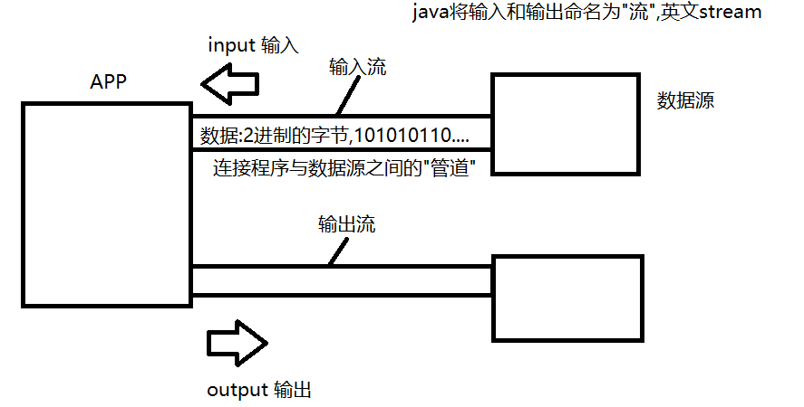

# day01

### File类

File类的每一个实例可以表示硬盘(文件系统)中的一个文件或目录(实际上表示的是一个抽象路径)

使用File可以做到:

- 1:访问其表示的文件或目录的属性信息,例如:名字,大小,修改时间等等
- 2:创建和删除文件或目录
- 3:访问一个目录中的子项

但是File不能访问文件数据.

```java
public class FileDemo {
    public static void main(String[] args) {
        //使用File访问当前项目目录下的demo.txt文件
        /*
            创建File时要指定路径，而路径通常使用相对路径。
            相对路径的好处在于有良好的跨平台性。
            "./"是相对路径中使用最多的，表示"当前目录"，而当前目录是哪里
            取决于程序运行环境而定，在idea中运行java程序时，这里指定的
            当前目录就是当前程序所在的项目目录。
         */
//        File file = new File("c:/xxx/xxx/xx/xxx.txt");
        File file = new File("./demo1.2.3.423.txt");
        //获取名字
        String name = file.getName();
        System.out.println(name);
        //获取文件大小(单位是字节)
        long len = file.length();
        System.out.println(len+"字节");
        //是否可读可写
        boolean cr = file.canRead();
        boolean cw = file.canWrite();
        System.out.println("是否可读:"+cr);
        System.out.println("是否可写:"+cw);
        //是否隐藏
        boolean ih = file.isHidden();
        System.out.println("是否隐藏:"+ih);

    }

}
```

#####  创建一个新文件

createNewFile()方法，可以创建一个新文件

```java
package file;

import java.io.File;
import java.io.IOException;

/**
 * 使用File创建一个新文件
 */
public class CreateNewFileDemo {
    public static void main(String[] args) throws IOException {
        //在当前目录下新建一个文件:test.txt
        File file = new File("./test.txt");
        //boolean exists()判断当前File表示的位置是否已经实际存在该文件或目录
        if(file.exists()){
            System.out.println("该文件已存在!");
        }else{
            file.createNewFile();//将File表示的文件创建出来
            System.out.println("文件已创建!");
        }

    }
}
```

#####  删除一个文件

delete()方法可以将File表示的文件删除

```java
package file;

import java.io.File;

/**
 * 使用File删除一个文件
 */
public class DeleteFileDemo {
    public static void main(String[] args) {
        //将当前目录下的test.txt文件删除
        /*
            相对路径中"./"可以忽略不写，默认就是从当前目录开始的。
         */
        File file = new File("test.txt");
        if(file.exists()){
            file.delete();
            System.out.println("文件已删除!");
        }else{
            System.out.println("文件不存在!");
        }
    }
}
```

#####  创建目录

mkDir():创建当前File表示的目录

mkDirs():创建当前File表示的目录，同时将所有不存在的父目录一同创建

```java
package file;

import java.io.File;

/**
 * 使用File创建目录
 */
public class MkDirDemo {
    public static void main(String[] args) {
        //在当前目录下新建一个目录:demo
//        File dir = new File("demo");
        File dir = new File("./a/b/c/d/e/f");

        if(dir.exists()){
            System.out.println("该目录已存在!");
        }else{
//            dir.mkdir();//创建目录时要求所在的目录必须存在
            dir.mkdirs();//创建目录时会将路径上所有不存在的目录一同创建
            System.out.println("目录已创建!");
        }
    }
}
```

##### 删除目录

delete()方法可以删除一个目录，但是只能删除空目录。

```java
package file;

import java.io.File;

/**
 * 删除一个目录
 */
public class DeleteDirDemo {
    public static void main(String[] args) {
        //将当前目录下的demo目录删除
        File dir = new File("demo");
//        File dir = new File("a");
        if(dir.exists()){
            dir.delete();//delete方法删除目录时只能删除空目录
            System.out.println("目录已删除!");
        }else{
            System.out.println("目录不存在!");
        }
    }
}
```

#####  访问一个目录中的所有子项

listFiles方法可以访问一个目录中的所有子项

```java
package file;

import java.io.File;

/**
 * 访问一个目录中的所有子项
 */
public class ListFilesDemo1 {
    public static void main(String[] args) {
        //获取当前目录中的所有子项
        File dir = new File(".");
        /*
            boolean isFile()
            判断当前File表示的是否为一个文件
            boolean isDirectory()
            判断当前File表示的是否为一个目录
         */
        if(dir.isDirectory()){
            /*
                File[] listFiles()
                将当前目录中的所有子项返回。返回的数组中每个File实例表示其中的一个子项
             */
            File[] subs = dir.listFiles();
            System.out.println("当前目录包含"+subs.length+"个子项");
            for(int i=0;i<subs.length;i++){
                File sub = subs[i];
                System.out.println(sub.getName());
            }
        }
    }
}
```

#####  获取目录中符合特定条件的子项

重载的listFiles方法:File[] listFiles(FileFilter)

该方法要求传入一个文件过滤器，并仅将满足该过滤器要求的子项返回。

```java
package file;

import java.io.File;
import java.io.FileFilter;

/**
 * 重载的listFiles方法，允许我们传入一个文件过滤器从而可以有条件的获取一个目录
 * 中的子项。
 */
public class ListFilesDemo2 {
    public static void main(String[] args) {
        /*
            需求:获取当前目录中所有名字以"."开始的子项
         */
        File dir = new File(".");
        if(dir.isDirectory()){
//            FileFilter filter = new FileFilter(){//匿名内部类创建过滤器
//                public boolean accept(File file) {
//                    String name = file.getName();
//                    boolean starts = name.startsWith(".");//名字是否以"."开始
//                    System.out.println("过滤器过滤:"+name+",是否符合要求:"+starts);
//                    return starts;
//                }
//            };
//            File[] subs = dir.listFiles(filter);//方法内部会调用accept方法

            
            File[] subs = dir.listFiles(new FileFilter(){
                public boolean accept(File file) {
                    return file.getName().startsWith(".");
                }
            });
            System.out.println(subs.length);
        }
    }
}
```


### Lambda表达式

JDK8之后,java支持了lambda表达式这个特性.

- lambda可以用更精简的代码创建匿名内部类.但是该匿名内部类实现的接口只能有一个抽象方法,否则无法使用!
- lambda表达式是编译器认可的,最终会将其改为内部类编译到class文件中

```java
package lambda;

import java.io.File;
import java.io.FileFilter;

/**
 * JDK8之后java支持了lambda表达式这个特性
 * lambda表达式可以用更精简的语法创建匿名内部类，但是实现的接口只能有一个抽象
 * 方法，否则无法使用。
 * lambda表达式是编译器认可的，最终会被改为内部类形式编译到class文件中。
 *
 * 语法:
 * (参数列表)->{
 *     方法体
 * }
 */
public class LambdaDemo {
    public static void main(String[] args) {
        //匿名内部类形式创建FileFilter
        FileFilter filter = new FileFilter() {
            public boolean accept(File file) {
                return file.getName().startsWith(".");
            }
        };

        FileFilter filter2 = (File file)->{
            return file.getName().startsWith(".");
        };

        //lambda表达式中参数的类型可以忽略不写
        FileFilter filter3 = (file)->{
            return file.getName().startsWith(".");
        };

        /*
            lambda表达式方法体中若只有一句代码，则{}可以省略
            如果这句话有return关键字，那么return也要一并省略!
         */
        FileFilter filter4 = (file)->file.getName().startsWith(".");
    }
}

```
### JAVA IO

- java io可以让我们用标准的读写操作来完成对不同设备的读写数据工作.
- java将IO按照方向划分为输入与输出,参照点是我们写的程序.
- 输入:用来读取数据的,是从外界到程序的方向,用于获取数据.
- 输出:用来写出数据的,是从程序到外界的方向,用于发送数据.

java将IO比喻为"流",即:stream. 就像生活中的"电流","水流"一样,它是以同一个方向顺序移动的过程.只不过这里流动的是字节(2进制数据).所以在IO中有输入流和输出流之分,我们理解他们是连接程序与另一端的"管道",用于获取或发送数据到另一端.



##### Java定义了两个超类(抽象类):

- java.io.InputStream:所有字节输入流的超类,其中定义了读取数据的方法.因此将来不管读取的是什么设备(连接该设备的流)都有这些读取的方法,因此我们可以用相同的方法读取不同设备中的数据
- java.io.OutputStream:所有字节输出流的超类,其中定义了写出数据的方法.

##### java将流分为两类:节点流与处理流:

- 节点流:也称为低级流.节点流的另一端是明确的,是实际读写数据的流,读写一定是建立在节点流基础上进行的.
- 处理流:也称为高级流.处理流不能独立存在,必须连接在其他流上,目的是当数据流经当前流时对数据进行加工处理来简化我们对数据的该操作.

##### 实际应用中,我们可以通过串联一组高级流到某个低级流上以流水线式的加工处理对某设备的数据进行读写,这个过程也成为流的连接,这也是IO的精髓所在.

#### 文件流

文件流是一对低级流,用于读写文件数据的流.用于连接程序与文件(硬盘)的"管道".负责读写文件数据.

##### 文件输出流:java.io.FileOutputStream

```java
package io;

import java.io.File;
import java.io.FileNotFoundException;
import java.io.FileOutputStream;
import java.io.IOException;

/**
 * JAVA IO
 * IO:Input,Output 即：输入与输出
 *
 * JAVA IO用于我们程序可以和外界交换数据。用于与外界的数据进行读写操作的。
 *
 * java中将输入与输出比喻为"流":stream
 * 如何理解流:讲流想象为一个连接我们程序和另一端的"管道",在其中按照同一方向顺序移动的数据。
 *          有点像"水管"中向着统一方向流动的水。
 * 输入流:从外界向我们的程序中移动的方向，因此是用来获取数据的流，作用就是:读取操作
 * 输出流:写出操作
 * 注意:流是单向的，输入永远用来读，输出永远用来写。将来我们在实际开发中希望与程序交互的另一端
 * 互相发送数据时，我们只需要创建一个可以连接另一端的"流"，进行读写操作完成。
 *
 * java定义了两个超类，来规范所有的字节流
 * java.io.InputStream:所有字节输入流的超类(抽象类)，里面定义了读取字节的相关方法。
 *                     所有字节输入流都继承自它
 * java.io.OutputStream:所有字节输出流的超类(抽象类)，里面定义了写出字节的相关方法。
 *                      所有的字节输出流都继承自它
 *
 *
 * 文件流
 * java.io.FileInputStream和java.io.FileOutputStream
 * 作用是真实连接我们程序和文件之间的"管道"。其中文件输入流用于从文件中读取字节。而文件输出流则
 * 用于向文件中写入字节。
 *
 * 文件流是节点流
 * JAVA IO将流划分为两类:节点流和处理流
 * 节点流:俗称"低级流"，特点:真实连接我们程序和另一端的"管道"，负责实际读写数据的流
 *       文件流就是典型的节点流，真实连接我们程序与文件的"管道"，可以读写文件数据了。
 * 处理流:俗称"高级流"
 *       特点:
 *       1:不能独立存在(单独实例化进行读写操作不可以)
 *       2:必须连接在其他流上，目的是当数据"流经"当前流时，可以对其做某种加工操作，简化我们的工作、
 * 流的连接:实际开发中经常会串联一组高级流最终到某个低级流上，对数据进行流水线式的加工读写。
 *
 */
public class FOSDemo {
    public static void main(String[] args) throws IOException {
        //需求:向当前目录的文件fos.dat中写入数据
        /*
            在创建文件输出流时，文件输出流常见的构造器:
            FileOutputStream(String filename)
            FileOutputStream(File file)
            上述两种构造器都会在创建时将该文件创建出来(如果该文件不存在才会这样做)，自动创建
            该文件的前提是该文件所在的目录必须存在，否则会抛出异常。
         */
        //        File file = new File("./fos.dat");
        //        FileOutputStream fos = new FileOutputStream(file);
        /*
            一个小技巧:在指定相对路径时，如果是从"当前目录"(./)开始的,那么"./"是可以忽略不写的
                      因为在相对路径中，默认就是从"./"开始
         */
//        FileOutputStream fos = new FileOutputStream("./fos.dat");
        FileOutputStream fos = new FileOutputStream("fos.dat");//与上面一句位置相同

        /*
            OutputStream(所有字节输出流的超类)中定义了写出字节的方法:

            其中:
            void write(int d)
            写出一个字节，将给定的参数int值对应的2进制的"低八位"写出。

            文件输出流继承OutputStream后就重写了该方法，作用是将该字节写入到文件中。
         */

        /*
            向文件中写入1个字节
            fow.write(1)
            将int值的1对应的2进制的"低八位"写如到文件第一个字节位置上

            1个int值占4个字节，每个字节是一个8为2进制
            int 1的2进制样子:
            00000000 00000000 00000000 00000001
                                       ^^^^^^^^
                                       写出的字节

            write方法调用后,fos.dat文件中就有了1个字节，内容为:
            00000001

            再次调用:
            fos.write(5)
            int 5的2进制样子:
            00000000 00000000 00000000 00000101
                                       ^^^^^^^^
                                       写出的字节
            write方法调用后,fos.dat文件中就有了2个字节，内容为:
            00000001 00000101
            上次写的   本次写的
         */

        fos.write(1);
        fos.write(5);

        System.out.println("写出完毕!");
        //注意！流使用完毕后要关闭，来释放底层资源
        fos.close();


    }
}

```


## 总结:

### File类

File类的每一个实例可以表示硬盘(文件系统)中的一个文件或目录(实际上表示的是一个抽象路径)

使用File可以做到:

- 1:访问其表示的文件或目录的属性信息,例如:名字,大小,修改时间等等
- 2:创建和删除文件或目录
- 3:访问一个目录中的子项

### 常用构造器:

- 	File(String pathname)
- 	File(File parent,String name)可参考文档了解

### 常用方法:

- length()：返回一个long值，表示占用的磁盘空间，单位为字节。
- canRead()：File表示的文件或目录是否可读
- canWrite()：File表示的文件或目录是否可写
- isHidden()：File表示的文件或目录是否为隐藏的
- createNewFile()：创建一个新文件，如果指定的文件所在的目录不存在会抛出异常java.io.FileNotFoundException
- mkdir：创建一个目录
- mkdirs：创建一个目录，并且会将所有不存在的父目录一同创建出来，推荐使用。
- delete()：删除当前文件或目录，如果目录不是空的则删除失败。
- exists()：判断File表示的文件或目录是否真实存在。true:存在   false:不存在
- isFile()：判断当前File表示的是否为一个文件。
- isDirectory()：判断当前File表示的是否为一个目录
- listFiles()：获取File表示的目录中的所有子项
- listFiles(FileFilter filter)：获取File表示的目录中满足filter过滤器要求的所有子项