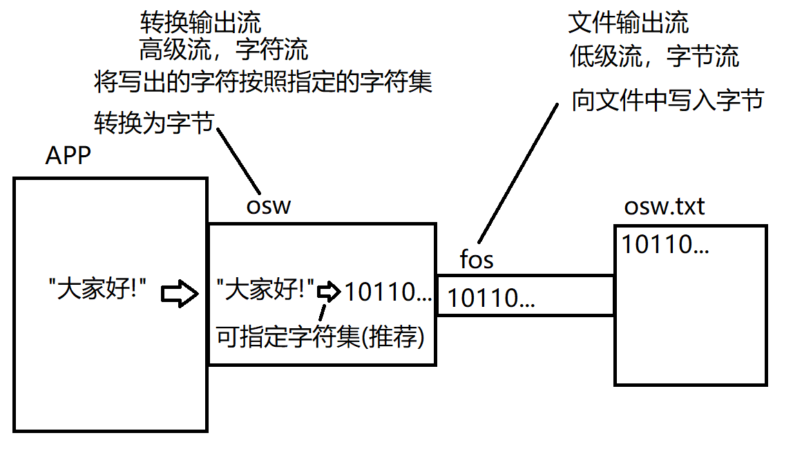
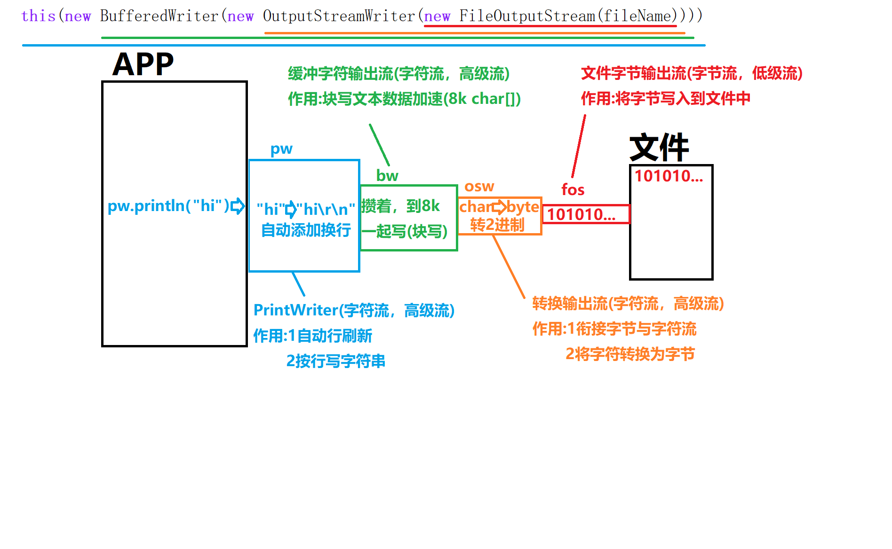
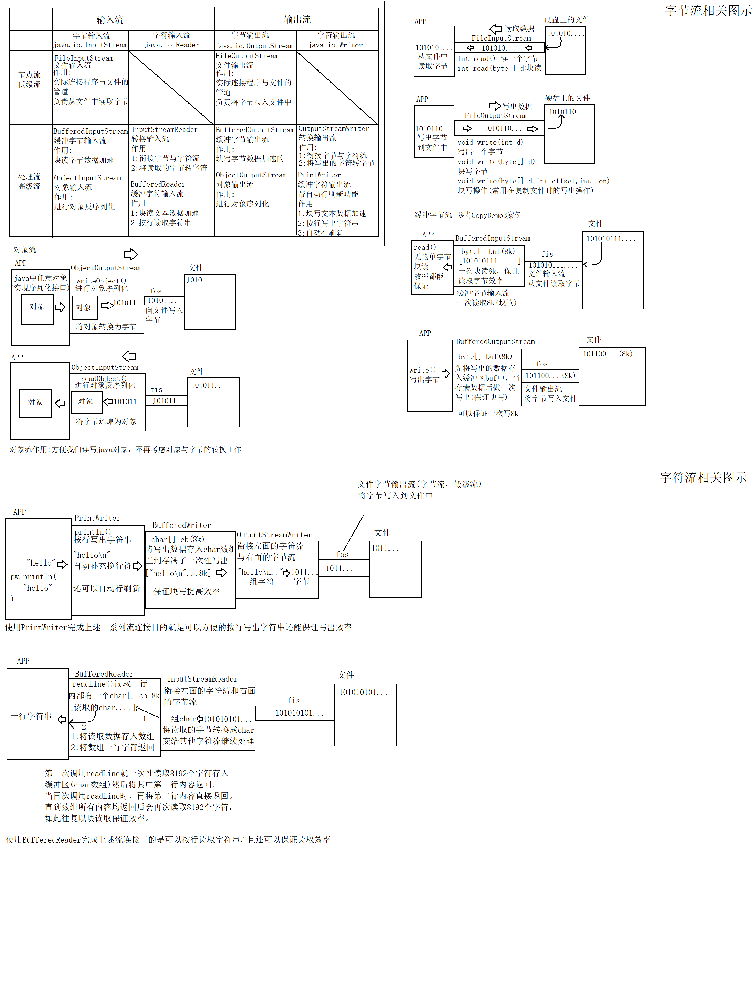
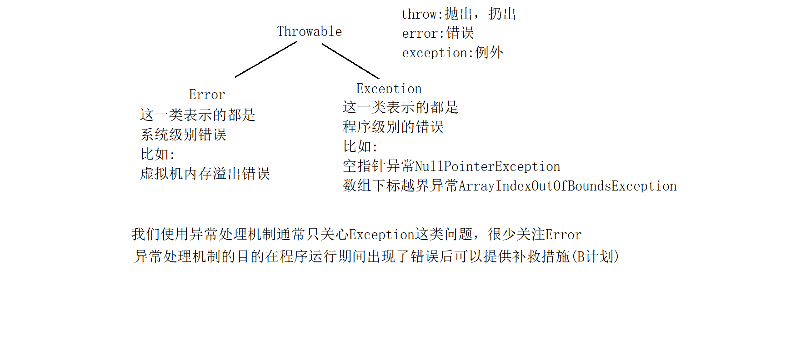

# day03

### 高级流

#### 对象流

java.io.ObjectOutputStream和ObjectInputSteam

对象流是一对高级流，在流连接中的作用是进行对象的序列化与反序列化。

对象序列化:将一个java对象按照其结构转换为一组字节的过程

对象反序列化:将一组字节还原为java对象(前提是这组字节是一个对象序列化得到的字节)

##### 对象序列化的流连接操作原理图:


```java
package io;

import java.io.FileOutputStream;
import java.io.IOException;
import java.io.ObjectOutputStream;

/**
 * 对象流(是一对高级流)
 * java.io.ObjectInputStream和ObjectOutputStream
 * 对象流在流连接中的作用是进行对象的序列化与反序列化
 * 其中对象输出流负责对象序列化。对象输入流负责对象反序列化
 *
 * 所谓对象序列化:
 * 将写出的对象按照其结构转换为一组字节的过程。
 */
public class OOSDemo {
  public static void main(String[] args) throws IOException {
    String name = "苍老师";
    int age = 55;
    String gender = "男";
    String[] otherInfo = {"摄影技术一流", "喜欢拍片儿", "是一名技术老师"};
    //将该Person对象写入文件person.obj中
    Person p = new Person(name, age, gender, otherInfo);

    FileOutputStream fos = new FileOutputStream("person.obj");
    ObjectOutputStream oos = new ObjectOutputStream(fos);
        /*
            对象输出流提供了一个直接写出对象的方法(进行对象序列化的操作)
            void writeObject(Object obj)

            序列化时可能出现异常：
            java.io.NotSerializableException: io.Person
            注:冒号后面的io.Person是指序列化的就是这个类的实例出现的错误
            原因:
            对象输出流在进行序列化对象时，要求该对象所属的类必须实现接口:java.io.Serializable接口
            并且该类中所有引用类型属性也必须实现该接口，否则会抛出上述异常。

         */
    oos.writeObject(p);
    System.out.println("写出完毕!");
    oos.close();


  }
}

```

##### 对象反序列化

```java
package io;

import java.io.FileInputStream;
import java.io.IOException;
import java.io.ObjectInputStream;

/**
 * 使用对象输入流完成对象的反序列化
 */
public class OISDemo {
  public static void main(String[] args) throws IOException, ClassNotFoundException {
    //从person.obj文件中将对象反序列化回来
    FileInputStream fis = new FileInputStream("person.obj");
    ObjectInputStream ois = new ObjectInputStream(fis);
        /*
            Object readObject()
            该方法会进行对象的反序列化，如果对象流通过其连接的流读取的字节分析并非
            是一个java对象时，会抛出异常:ClassNotFoundException
         */
    Person p = (Person) ois.readObject();
    System.out.println(p);
  }
}
```

需要进行序列化的类必须实现接口:java.io.Serializable 实现序列化接口后最好主动定义序列化版本号这个常量。 这样一来对象序列化时就不会根据类的结构生成一个版本号,而是使用该固定值。 那么反序列化时，只要还原的对象和当前类的版本号一致就可以进行还原。

transient关键字可以修饰属性，用于在进行对象序列化时忽略不必要的属性，达到对象瘦身的目的

```java
package io;

import java.io.Serializable;
import java.util.Arrays;

/**
 * 使用当前类实例测试对象流的读写操作
 */
public class Person implements Serializable {
    public static final long serialVersionUID = 1L;
    private String name;//姓名
    private int age;//年龄
    private String gender;//性别
    private String[] otherInfo;//其他信息

    public Person(String name, int age, String gender, String[] otherInfo) {
        this.name = name;
        this.age = age;
        this.gender = gender;
        this.otherInfo = otherInfo;
    }

    public String getName() {
        return name;
    }

    public void setName(String name) {
        this.name = name;
    }

    public int getAge() {
        return age;
    }

    public void setAge(int age) {
        this.age = age;
    }

    public String getGender() {
        return gender;
    }

    public void setGender(String gender) {
        this.gender = gender;
    }

    public String[] getOtherInfo() {
        return otherInfo;
    }

    public void setOtherInfo(String[] otherInfo) {
        this.otherInfo = otherInfo;
    }

    @Override
    public String toString() {
        return "Person{" +
                "name='" + name + '\'' +
                ", age=" + age +
                ", gender='" + gender + '\'' +
                ", otherInfo=" + Arrays.toString(otherInfo) +
                '}';
    }
}
```

### 字符流

- java将流按照读写单位划分为字节流与字符流.
- java.io.InputStream和OutputStream是所有字节流的超类
- 而java.io.Reader和Writer则是所有字符流的超类,它们和字节流的超类是平级关系.
- Reader和Writer是两个抽象类,里面规定了所有字符流都必须具备的读写字符的相关方法.
- 字符流最小读写单位为字符(char),但是底层实际还是读写字节,只是字符与字节的转换工作由字符流完成.

#### 转换流

java.io.InputStreamReader和OutputStreamWriter

它们是字符流非常常用的一对实现类同时也是一对高级流,实际开发中我们不直接操作它们,但是它们在流连接中是非常重要的一环.

##### 使用转换输出流向文件中写入文本数据



```java
package io;

import java.io.*;
import java.nio.charset.StandardCharsets;

/**
 * JAVA IO将流按照读写数据的单位将流分为了两类:字节流与字符流
 * java.io.InputStream和OutputStream这两个超类是所有【字节流】的超类
 * java.io.Reader和Writer这两个是所有【字符流】的超类
 * 这两对超类之间是没有继承关系的，属于平级的。
 *
 * 字符流是以字符为最小单位(char)读写数据的。
 * 注:底层实际还是读写字节，只不过字符与字节的转换由字符流自动完成了。
 * 由于字符流最小读写单位为字符，因此字符流【只适合读写文本数据】
 *
 * 转换流(是一对高级流，同时是一对字符流)
 * 作用:
 * 1:衔接字节流与其他字符流
 * 2:将字符与字节相互转换
 * 实际开发中我们不会直接使用这一对流，但是在流连接中它是重要的一环。
 */
public class OSWDemo {
    public static void main(String[] args) throws IOException {
        /*
            使用这一对流演示转换流的读写字符方法

            java.io.Writer所有字符输出流的超类上，定义了写出字符的相关方法
            void write(int d)写出一个字符，实际传入的应当是一个char。
            void write(char[] data)
            void write(char[] data,int offset,int len)
            void write(String str) 直接写出一个字符串
         */
        FileOutputStream fos = new FileOutputStream("osw.txt");
        OutputStreamWriter osw = new OutputStreamWriter(fos,StandardCharsets.UTF_8);

        String line = "如果你突然打了个喷嚏，那一定就是我在想你。";
        osw.write(line);//转换流的write(String str)会将写出的字符串转换为字节然后写出
        osw.write("如果半夜被手机吵醒，那一定就是我关心。");
        System.out.println("写出完毕!");
        osw.close();


    }
}

```

##### 使用转换输入流读取文本文件

```java
package io;

import java.io.*;

/**
 * 转换字符输入流
 * 可以将读取的字节按照指定的字符集转换为字符
 */
public class ISRDemo {
    public static void main(String[] args) throws IOException {
        //将osw.txt文件中的所有文字读取回来.
        FileInputStream fis = new FileInputStream("osw.txt");
        InputStreamReader isr = new InputStreamReader(fis,"UTF-8");
        /*
            字符流读一个字符的read方法定义:
            int read()
            读取一个字符,返回的int值实际上表示的是一个char(低16位有效).如果返回的
            int值表示的是-1则说明EOF
         */
        //测试读取文件中第一个字
//        int d = isr.read();
//        char c = (char)d;
//        System.out.println(c);

        //循环将文件所有字符读取回来
        int d;
        while((d = isr.read()) != -1){
            System.out.print((char)d);
        }

        isr.close();
    }
}
```

##### 转换流的意义:

实际开发中我们还有功能更好用的字符高级流.但是其他的字符高级流都有一个共通点:不能直接连接在字节流上.而实际操作设备的流都是低级流同时也都是字节流.因此不能直接在流连接中串联起来.转换流是一对可以连接在字节流上的字符流,其他的高级字符流可以连接在转换流上.在流连接中起到"转换器"的作用(负责字符与字节的实际转换)

#### 缓冲字符流

##### 缓冲字符输出流:java.io.PrintWriter

java.io.BufferedWriter和BufferedReader

缓冲字符流内部也有一个缓冲区,读写文本数据以块读写形式加快效率.并且缓冲流有一个特别的功能:可以按行读写文本数据.

java.io.PrintWriter具有自动行刷新的缓冲字符输出流,实际开发中更常用.它内部总是会自动连接BufferedWriter作为块写加速使用.



```java
package io;

import java.io.FileNotFoundException;
import java.io.FileOutputStream;
import java.io.PrintWriter;
import java.io.UnsupportedEncodingException;

/**
 * 缓冲字符流(是一对高级流)
 * java.io.BufferedWriter和BufferedReader
 * 缓冲流内部维护一个char数组，默认长度8k.以块读写方式读写字符数据保证效率
 *
 * java.io.PrintWriter则是具有自动行刷新的换成字符输出流(实际缓冲功能是靠BufferedWriter
 * 实现的，它内部总是连接着这个流。)
 *
 * 使用缓冲字符流后就可以实现按行读写字符串，并且读写效率高。
 */
public class PWDemo1 {
    public static void main(String[] args) throws FileNotFoundException, UnsupportedEncodingException {
        //按行向文件pw.txt中写入字符串
        /*
            PrintWriter继承自Writer.
            它提供很多构造方法，其中就有可以直接对文件进行写操作的构造器
            PrintWriter(File file)
            PrintWriter(String filename)
         */
//        PrintWriter pw = new PrintWriter("pw.txt");
        /*
            这里可以按照指定的字符集写出字符串到文本文件中。但是字符集只能以字符串形式
            表达。因此注意拼写。字符集不区分大小写。
            但是如果字符集名字拼写错误，会抛出异常:
            UnsupportedEncodingException
            不支持的    字符集    异常
         */
        PrintWriter pw = new PrintWriter("pw.txt","UTF-8");
        /*
            println()方法是输出字符出后带上换行符
            print()方法输出字符串后不带换行符
         */
        pw.println("夜空中最亮的星，能否听清。");
        pw.println("那仰望的人，心底的孤独和叹息。");
        System.out.println("写出完毕!");
        pw.close();

    }
}

```

##### 在流链接中使用PW

```java
package io;

import java.io.*;
import java.nio.charset.StandardCharsets;
import java.util.Scanner;

/**
 * 练习PrintWriter的流连接操作
 */
public class PWDemo2 {
    public static void main(String[] args) throws FileNotFoundException {
        //文件输出流(低级流，字节流) 作用:向文件中写出字节
        FileOutputStream fos = new FileOutputStream("pw2.txt");
        //转换输出流(高级流，字符流) 作用:1衔接字符与字节流的 2:将写出的字符转换为字节
        OutputStreamWriter osw = new OutputStreamWriter(fos, StandardCharsets.UTF_8);
        //缓冲字符输出流(高级流，字符流) 作用:块写文本数据加速的(内部有一个8k的char数组)
        BufferedWriter bw = new BufferedWriter(osw);
        //具有自动行刷新功能(高级流，字符流) 作用:1按行写出字符串(println) 2:自动行刷新
        PrintWriter pw = new PrintWriter(bw);

        /*
            完成一个简易记事本工具
            将控制台上输入的每一行字符串按行写入到该文件中
            如果单独输入exit,则程序退出。
            思路:
            用一个死循环，重复做下面的工作
            1:在控制台上输入一行字符串
            2:判断输入的字符串是否为"exit"
              若是:则break掉循环退出程序
              若不是:则将输入的字符串通过println方法写入文件
         */
        Scanner scanner = new Scanner(System.in);
        while(true) {
           String line = scanner.nextLine();
           if("exit".equals(line)){
                break;
           }
           pw.println(line);
        }
        System.out.println("写出完毕!");

        pw.close();
    }
}

```


#### 缓冲字符流

##### PrintWriter的自动行刷新功能

如果实例化PW时第一个参数传入的是一个流，则此时可以再传入一个boolean型的参数，此值为true时就打开了自动行刷新功能。 即: 每当我们用PW的println方法写出一行字符串后会自动flush.

```java
package io;

import java.io.*;
import java.nio.charset.StandardCharsets;
import java.util.Scanner;

/**
 * 练习PrintWriter的流连接操作
 */
public class PWDemo2 {
    public static void main(String[] args) throws FileNotFoundException {
        //文件输出流(低级流，字节流) 作用:向文件中写出字节
        FileOutputStream fos = new FileOutputStream("pw2.txt");
        //转换输出流(高级流，字符流) 作用:1衔接字符与字节流的 2:将写出的字符转换为字节
        OutputStreamWriter osw = new OutputStreamWriter(fos, StandardCharsets.UTF_8);
        //缓冲字符输出流(高级流，字符流) 作用:块写文本数据加速的(内部有一个8k的char数组)
        BufferedWriter bw = new BufferedWriter(osw);
        //具有自动行刷新功能(高级流，字符流) 作用:1按行写出字符串(println) 2:自动行刷新
        /*
            当我们创建PrintWriter时，构造方法里第一个参数为一个流，那么就支持再传入
            一个boolean值参数表示是否打开自动行刷新功能，传入true则打开。
            此时每当我们调用它的println方法写出一行字符串后就会自动flush()一次。
            注意:print方法和write方法写出字符串时并不会自动flush()!!!!
         */
        PrintWriter pw = new PrintWriter(bw,true);

        /*
            完成一个简易记事本工具
            将控制台上输入的每一行字符串按行写入到该文件中
            如果单独输入exit,则程序退出。
            思路:
            用一个死循环，重复做下面的工作
            1:在控制台上输入一行字符串
            2:判断输入的字符串是否为"exit"
              若是:则break掉循环退出程序
              若不是:则将输入的字符串通过println方法写入文件
         */
        Scanner scanner = new Scanner(System.in);
        while(true) {
           String line = scanner.nextLine();
           if("exit".equals(line)){
                break;
           }
           pw.println(line);
//           pw.print("");//不会自动flush
//           pw.write("");//不会自动flush
        }
        System.out.println("写出完毕!");

        pw.close();
    }
}

```

#### 缓冲字符流

##### 缓冲字符输入流:java.io.BufferedReader

是一个高级的字符流，特点是块读文本数据，并且可以按行读取字符串。

```java
package io;

import java.io.*;

/**
 * 使用缓冲字符输入流按行读取字符串
 * 该高级流的主要作用:
 * 1:块读文本数据加速(内部有一个默认8k的char数组)
 * 2:可以按行读取字符串
 */
public class BRDemo {
    public static void main(String[] args) throws IOException {
        //将当前源代码输出到控制台上
        /*
            思路:
            读取当前源代码文件，按行读取，并且将读取到的每一行字符串都输出到控制台上即可
         */
        //文件输入流(低级流，字节流) 作用:从文件中读取字节
        FileInputStream fis = new FileInputStream("./src/io/BRDemo.java");
        //转换输入流(字符流，高级流) 作用:1衔接字节与字符流 2将读取的字节转换为字符
        InputStreamReader isr = new InputStreamReader(fis);
        //缓冲字符输入流(字符流，高级流) 作用:1块读字符数据加速  2按行读取字符串
        BufferedReader br = new BufferedReader(isr);
        /*
            BufferedReader缓冲字符输入流
            提供了一个独有的方法:readLine()
            作用:读取一行字符串。连续读取若干字符直到遇到了换行符位置，并将换行符之前的
                内容返回。注意:返回的字符串里不包含最后的换行符。
                特殊情况:
                如果这一行只有一个换行符，那么返回值为空字符串:""
                如果读取到了流的末尾，那么返回值为null。

            实际运行时:
            当我们第一次调用readLine()方法时，缓冲字符输入流实际会一次性读取8k的char
            回来并存入内部的char数组中(块读文本操作)。readLine方法只将char数组中从头
            开始一直到第一个换行符位置的内容以一个字符串形式返回。
         */
        String line;
        while((line = br.readLine()) != null){
            System.out.println(line);
        }

        br.close();
    }
}


```

##### IO总结




### 异常处理

#### java异常处理机制

- java中所有错误的超类为:Throwable。其下有两个子类:Error和Exception

- Error的子类描述的都是系统错误，比如虚拟机内存溢出等。

- Exception的子类描述的都是程序错误，比如空指针，下表越界等。

- 通常我们程序中处理的异常都是Exception。

  

#### 异常处理机制中的try-catch

```java
package exception;

/**
 * 异常处理机制中的try-catch
 * 语法:
 * try{
 *     代码片段...
 * }catch(XXXException e){
 *     出现错误后的补救措施(B计划)
 * }
 */
public class TryCatchDemo {
    public static void main(String[] args) {
        System.out.println("程序开始了...");
        /*
            try{}语句块不能单独写，后面要么跟catch语句块要么跟finally语句块

            异常处理机制关注的是:明知道程序可能出现某种错误，但是该错误无法通过修改逻辑
            完全规避掉时，我们会使用异常处理机制，在出现该错误是提供一种补救办法。
            凡是能通过逻辑避免的错误都属于bug！就应当通过逻辑去避免!
         */
        try {
//            String str = null;
//            String str = "";
            String str = "a";
        /*
            若str=null的情况
            当JVM执行到下面代码时:str.length()会出现空指针，此时虚拟机就会根据该情况
            实例化一个对应的异常实例出来，即:空指针异常实例 NullPointerException实例
            然后将程序从一开始执行到报错这句话的过程设置到该异常实例中，此时该异常通过
            类型名字可以表达出现了什么错误，并将来可以通过输出错误信息来得知错误出现在那里
            虚拟机会将该异常抛出
            当某句代码抛出了一个异常时，JVM会做如下操作:
            1:检查报错这句话是否有被异常处理机制控制(有没有try-catch)
              如果有，则执行对应的catch操作，如果没有catch可以捕获该异常则视为没有
              异常处理动作
            2:如果没有异常处理，则异常会被抛出当当前代码所在的方法之外由调用当前方法的
              代码片段处理该异常
         */
            System.out.println(str.length());//抛出空指针异常
            System.out.println(str.charAt(0));
            System.out.println(Integer.parseInt(str));
            /*
                当try中某句代码报错后，就会跳出try执行下面对应的catch块，执行后就会
                退出catch继续向后执行。因此try语句块中报错代码以下的内容都不会被执行
             */
            System.out.println("!!!!!!!!!!!!!!");
//        }catch(NullPointerException e){
//            //这里实际开发中是写补救措施的，通常也会将异常信息输出便于debug
//            System.out.println("出现了空指针，并解决了!");
//        }catch(StringIndexOutOfBoundsException e){
//            System.out.println("处理字符串下标越界问题!");
//        }
        /*
            当try语句块中可能出现的几种不同异常对应的处理办法相同时，可以采取合并
            catch的做法，用同一个catch来捕获这几种可能出现的异常，而执行措施使用
            同一个。
         */
        }catch(NullPointerException|StringIndexOutOfBoundsException e){
            System.out.println("处理空指针或下标越界!");
        /*
            当catch捕获某个超类型异常时，那么try语句块中出现它类型异常时都可以被这个
            catch块捕获并处理。

            如果多个catch捕获的异常之间存在继承关系时，一定是子类异常在上超类异常在下
         */
        }catch(Exception e){
            System.out.println("反正就是出了个错!");
        }
        System.out.println("程序结束了...");
    }
}

```

#### 异常处理机制中的finally

- finally块定义在异常处理机制中的最后一块。它可以直接跟在try之后，或者最后一个catch之后。
- finally可以保证只要程序执行到了try语句块中，无论try语句块中的代码是否出现异常，最终finally都必定执行。
- finally通常用来做释放资源这类操作。

```java
package exception;

/**
 * finally块
 * finally块是异常处理机制中的最后一块，它可以直接跟在try语句块之后或者最后一个catch块
 * 之后。
 * finally可以保证只要程序执行到try语句块中，无论try语句块中的代码是否出现异常，finally
 * 都【必定执行】!
 * 通常finally块用于做释放资源这类操作，比如IO操作后的关闭流动作就非常适合在finally中进行
 */
public class FinallyDemo {
    public static void main(String[] args) {
        System.out.println("程序开始了...");
        try{
            String str = "abc";
            System.out.println(str.length());
            return;
        }catch(Exception e){
            System.out.println("出错了，并处理了");
        }finally{
            System.out.println("finally中的代码执行了!");
        }
        System.out.println("程序结束了");
    }
}

```

#### IO操作时的异常处理机制应用

```java
package exception;

import java.io.FileOutputStream;
import java.io.IOException;

/**
 *  异常处理机制在IO中的实际应用
 */
public class FinallyDemo2 {
    public static void main(String[] args) {
        FileOutputStream fos = null;
        try {
            fos = new FileOutputStream("fos.dat");
            fos.write(1);
        } catch (IOException e) {
            e.printStackTrace();
        } finally {
            try {
                if(fos!=null) {
                    fos.close();
                }
            } catch (IOException e) {
                e.printStackTrace();
            }
        }
    }
}

```

#### 自动关闭特性

JDK7之后，java提供了一个新的特性:自动关闭。旨在IO操作中可以更简洁的使用异常处理机制完成最后的close操作。

```java
语法:
try(
       定义需要在finally中调用close()方法关闭的对象.
){
    IO操作
}catch(XXXException e){
    ...
}
```

上述语法中可在try的"()"中定义的并初始化的对象必须实现了java.io.AutoCloseable接口,否则编译不通过.

```
package exception;

import java.io.FileOutputStream;
import java.io.IOException;

/**
 * JDK7之后java推出了一个特性:自动关闭特性
 * 旨在让我们用更简洁的语法完成IO操作的异常处理机制(主要就是简化了finally关闭流的操作)
 */
public class AutoCloseableDemo {
    public static void main(String[] args) {
        /*
            该特性是编译器认可的，并非虚拟机。实际上编译器编译完毕后的样子可参考FinallyDemo2
         */
        try(
                //只有实现了AutoCloseable接口的类才可以在这里定义!编译器最终会补充代码在finally中调用其close关闭
                FileOutputStream fos = new FileOutputStream("fos.dat");
        ){
            fos.write(1);
        } catch (IOException e) {
            e.printStackTrace();
        }

    }
}

```

上述代码是编译器认可的，而不是虚拟机。编译器在编译上述代码后会在编译后的class文件中改回成FinallyDemo2案例的代码样子(上次课最后的案例)。


## 总结

##### java将流分为两类:节点流与处理流:

- **节点流**:也称为**低级流**.

  节点流的另一端是明确的,是实际读写数据的流,读写一定是建立在节点流基础上进行的.

- **处理流**:也称为**高级流**.

  处理流不能独立存在,必须连接在其他流上,目的是当数据流经当前流时对数据进行加工处理来简化我们对数据的该操作.

##### 实际应用中,我们可以通过串联一组高级流到某个低级流上以流水线式的加工处理对某设备的数据进行读写,这个过程也成为流的连接,这也是IO的精髓所在.

## 缓冲流

缓冲流是一对高级流，在流链接中链接它的**目的是加快读写效率**。缓冲流内部**默认缓冲区为8kb**，缓冲流**总是块读写数据来提高读写效率**。

#### java.io.BufferedOutputStream缓冲字节输出流，继承自java.io.OutputStream

##### 常用构造器

- BufferedOutputStream(OutputStream out)：创建一个默认8kb大小缓冲区的缓冲字节输出流，并连接到参数指定的字节输出流上。
- BufferedOutputStream(OutputStream out,int size)：创建一个size指定大小(单位是字节)缓冲区的缓冲字节输出流，并连接到参数指定的字节输出流上。

##### 常用方法

```
flush()：强制将缓冲区中已经缓存的数据一次性写出

缓冲流的写出方法功能与OutputStream上一致，需要知道的时write方法调用后并非实际写出，而是先将数据存入缓冲区(内部的字节数组中)，当缓冲区满了时会自动写出一次。
```

#### java.io.BufferedInputStream缓冲字节输出流，继承自java.io.InputStream

##### 常用构造器

- BufferedInputStream(InputStream in)：创建一个默认8kb大小缓冲区的缓冲字节输入流，并连接到参数指定的字节输入流上。
- BufferedInputStream(InputStream in,int size)：创建一个size指定大小(单位是字节)缓冲区的缓冲字节输入流，并连接到参数指定的字节输入流上。

##### 常用方法

```
缓冲流的读取方法功能与InputStream上一致，需要知道的时read方法调用后缓冲流会一次性读取缓冲区大小的字节数据并存入缓冲区，然后再根据我们调用read方法读取的字节数进行返回，直到缓冲区所有数据都已经通过read方法返回后会再次读取一组数据进缓冲区。即:块读取操作
```

### 对象流

对象流是一对高级流，在流链接中的作用是完成对象的**序列化**与**反序列化**

序列化：是对象输出流的工作，将一个对象按照其结构转换为一组字节的过程。

反序列化：是对象输入流的工作，将一组字节还原为对象的过程。

#### java.io.ObjectInputStream对象输入流，继承自java.io.InputStream

##### 常用构造器

ObjectInputStream(InputStream in)：创建一个对象输入流并连接到参数in这个输入流上。

##### 常用方法

Object readObject()：进行对象反序列化，将读取的字节转换为一个对象并以Object形式返回(多态)。

如果读取的字节表示的不是一个java对象会抛出异常:java.io.ClassNotFoundException

#### java.io.ObjectOutputStream对象输出流，继承自java.io.OutputStream

##### 常用构造器

ObjectOutputStream(OutputStream out)：创建一个对象输出流并连接到参数out这个输出流上

##### 常用方法

void writeObject(Object obj)：进行对象的序列化，将一个java对象序列化成一组字节后再通过连接的输出流将这组字节写出。

**如果序列化的对象没有实现可序列化接口:java.io.Serializable就会抛出异常:java.io.NotSerializableException**

#### 序列化接口java.io.Serrializable

该接口没有任何抽象方法，但是只有实现了该接口的类的实例才能进行序列化与反序列化。

实现了序列化接口的类建议显示的定义常量:static final long serialVersionUID = 1L;

可以为属性添加关键字**transient**，被该关键字修饰的属性在序列化是会被忽略，达到对象**序列化瘦身**的目的。

#### 字符流

java将流按照读写单位划分为字节与字符流。字节流以字节为单位读写，字符流以字符为单位读写。

##### 转换流java.io.InputStreamReader和OutputStreamWriter

功能无需掌握，了解其核心意义:

1:衔接其它字节与字符流

2:将字符与字节进行转换

相当于是现实中的"转换器"

### 缓冲字符输出流

缓冲字符输出流需要记住的是PrintWriter和BufferedReader

作用:

1:块写或块读文本数据加速

2:可以按行写或读字符串

#### java.io.PrintWriter 具有自动行刷新的缓冲字符输出流

##### 常用构造器

PrintWriter(String filename) :可以直接对给定路径的文件进行写操作

PrintWriter(File file):可以直接对File表示的文件进行写操作

上述两种构造器内部会自动完成流连接操作。

PrintWriter(OutputStream out):将PW链接在给定的字节流上(构造方法内部会自行完成转换流等流连接)

PrintWriter(Writer writer):将PW链接在其它字符流上

PrintWriter(OutputStream out,boolean autoflush)

PrintWriter(Writer writer,boolean autoflush)

上述两个构造器可以在链接到流上的同时传入第二个参数，如果该值为true则开启了自动行刷新功能。

##### 常用方法

void println(String line)：按行写出一行字符串

##### 特点

自动行刷新，当打开了该功能后，每当使用println方法写出一行字符串后就会自动flush一次

#### java异常处理机制:

- 异常处理机制是用来处理那些可能存在的异常，但是无法通过修改逻辑完全规避的场景。
- 而如果通过修改逻辑可以规避的异常是bug，不应当用异常处理机制在运行期间解决！应当在编码时及时修正

try语句块用来包含可能出错的代码片段

catch用来捕获并处理对应的异常，可以定义多个，也可以合并多个异常在一个catch中。

finally是异常的最后一块，只要程序执行到try中则必走。一般用于释放资源这类操作。

throw用于主动对外抛出异常。要么是满足语法不满足业务主动抛出异常，要么就是实际发生了异常但是不应当在当前代码片段被解决是抛出。具体情况要结合实际业务分析。

throws用于在方法声明时声明该异常的抛出，使得调用者必须处理该异常。